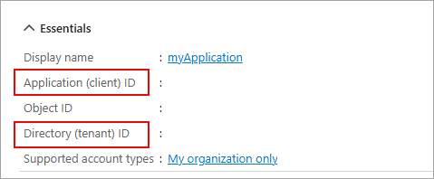

---
lab:
  topic: Azure authentication and authorization
  title: Récupérer les informations du profil utilisateur avec le kit de développement logiciel (SDK) Microsoft Graph
  description: Découvrez comment récupérer les informations de profil utilisateur à partir de Microsoft Graph.
---

# Récupérer les informations du profil utilisateur avec le kit de développement logiciel (SDK) Microsoft Graph

Dans cet exercice, vous allez créer une application .NET pour vous authentifier avec Microsoft Entra ID et demander un jeton d’accès, puis appeler l’API Microsoft Graph pour récupérer et afficher les informations de votre profil utilisateur. Vous allez apprendre à configurer les autorisations et à interagir avec Microsoft Graph depuis votre application.

Tâches effectuées dans cet exercice :

* Inscrire une application avec la plateforme d’identités Microsoft
* Créez une application console .NET qui implémente l’authentification interactive et utilise la classe **GraphServiceClient** pour récupérer les informations du profil utilisateur.

Cet exercice dure environ **15** minutes.

## Avant de commencer

Pour compléter cet exercice, vous avez besoin de :

* Un abonnement Azure. Si vous n’en avez pas, vous pouvez [vous inscrire](https://azure.microsoft.com/).

* [Visual Studio Code](https://code.visualstudio.com/) sur l’une des [plateformes prises en charge](https://code.visualstudio.com/docs/supporting/requirements#_platforms).

* [.NET 8](https://dotnet.microsoft.com/en-us/download/dotnet/8.0) ou d’une version ultérieure.

* [Kit de développement C#](https://marketplace.visualstudio.com/items?itemName=ms-dotnettools.csdevkit) pour Visual Studio Code.

## Inscrire une nouvelle application

1. Dans votre navigateur, accédez au portail Azure [https://portal.azure.com](https://portal.azure.com) et connectez-vous en utilisant vos informations d’identification Azure.

1. Dans le portail, recherchez et sélectionnez **Enregistrements d’applications**. 

1. Sélectionnez **+ Nouvel enregistrement**, puis, lorsque la page **Enregistrer une application** s’affiche, entrez les informations d’enregistrement de votre application :

    | Champ | Valeur |
    |--|--|
    | **Nom** | Entrez `myGraphApplication`  |
    | **Types de comptes pris en charge** | Sélectionnez **Comptes dans cet annuaire organisationnel uniquement** |
    | **URI de redirection (facultatif)** | Sélectionnez **Client public/natif (mobile & bureau)** et entrez `http://localhost` dans la case à droite. |

1. Sélectionnez **Inscrire**. Microsoft Entra ID attribue un ID d’application unique (client) à votre application, et vous êtes redirigé vers la page **Vue d’ensemble** de votre application. 

1. Dans la section **Essentiels** de la page **Vue d’ensemble**, enregistrez l’**ID d’application (client)** et l’**ID du répertoire (locataire)**. Ces informations sont nécessaires pour l’application.

    
 
## Créez une application console .NET pour envoyer et recevoir des messages

Maintenant que les ressources nécessaires sont déployées sur Azure, l’étape suivante consiste à configurer l’application console. Les étapes suivantes sont effectuées dans votre environnement local.

1. Créez un dossier nommé **graphapp**, ou un nom de votre choix, pour le projet.

1. Lancez **Visual Studio Code**, sélectionnez **Fichier > Ouvrir le dossier...** et sélectionnez le dossier du projet.

1. Sélectionnez **Afficher > Terminal** pour ouvrir un terminal.

1. Exécutez la commande suivante dans le terminal VS Code pour créer l’application console .NET.

    ```
    dotnet new console
    ```

1. Exécutez les commandes suivantes pour ajouter les packages **Azure.Identity**, **Microsoft.Graph** et **dotenv.net** au projet.

    ```
    dotnet add package Azure.Identity
    dotnet add package Microsoft.Graph
    dotnet add package dotenv.net
    ```

### Configurez l’application console

Dans cette section, vous allez créer et modifier un fichier **.env** pour y stocker les secrets que vous avez notés précédemment. 

1. Sélectionnez **Fichier > Nouveau fichier...** et créez un fichier nommé *.env* dans le dossier du projet.

1. Ouvrez le fichier **.env** et ajoutez le code suivant. Remplacez **YOUR_CLIENT_ID** et **YOUR_TENANT_ID** par les valeurs que vous avez enregistrées précédemment.

    ```
    CLIENT_ID="YOUR_CLIENT_ID"
    TENANT_ID="YOUR_TENANT_ID"
    ```

1. Appuyez sur **ctrl+s** pour enregistrer le fichier.

### Ajoutez le code de démarrage pour le projet

1. Ouvrez le fichier *Program.cs* et remplacez tout contenu existant par le code suivant. Veillez à bien relire les commentaires dans le code.

    ```csharp
    using Microsoft.Graph;
    using Azure.Identity;
    using dotenv.net;
    
    // Load environment variables from .env file (if present)
    DotEnv.Load();
    var envVars = DotEnv.Read();
    
    // Read Azure AD app registration values from environment
    string clientId = envVars["CLIENT_ID"];
    string tenantId = envVars["TENANT_ID"];
    
    // Validate that required environment variables are set
    if (string.IsNullOrEmpty(clientId) || string.IsNullOrEmpty(tenantId))
    {
        Console.WriteLine("Please set CLIENT_ID and TENANT_ID environment variables.");
        return;
    }
    
    // ADD CODE TO DEFINE SCOPE AND CONFIGURE AUTHENTICATION
    
    
    
    // ADD CODE TO CREATE GRAPH CLIENT AND RETRIEVE USER PROFILE
    
    
    ```

1. Appuyez sur **ctrl+s** pour enregistrer vos modifications.

### Ajoutez le code pour terminer l’application

1. Recherchez le commentaire **// ADD CODE TO DEFINE SCOPE AND CONFIGURE AUTHENTICATION** et ajoutez le code suivant directement après le commentaire. Veillez à bien relire les commentaires dans le code.

    ```csharp
    // Define the Microsoft Graph permission scopes required by this app
    var scopes = new[] { "User.Read" };
    
    // Configure interactive browser authentication for the user
    var options = new InteractiveBrowserCredentialOptions
    {
        ClientId = clientId, // Azure AD app client ID
        TenantId = tenantId, // Azure AD tenant ID
        RedirectUri = new Uri("http://localhost") // Redirect URI for auth flow
    };
    var credential = new InteractiveBrowserCredential(options);
    ```

1. Recherchez le commentaire **// ADD CODE TO CREATE GRAPH CLIENT AND RETRIEVE USER PROFILE** et ajoutez le code suivant directement après le commentaire. Veillez à bien relire les commentaires dans le code.

    ```csharp
    // Create a Microsoft Graph client using the credential
    var graphClient = new GraphServiceClient(credential);
    
    // Retrieve and display the user's profile information
    Console.WriteLine("Retrieving user profile...");
    await GetUserProfile(graphClient);
    
    // Function to get and print the signed-in user's profile
    async Task GetUserProfile(GraphServiceClient graphClient)
    {
        try
        {
            // Call Microsoft Graph /me endpoint to get user info
            var me = await graphClient.Me.GetAsync();
            Console.WriteLine($"Display Name: {me?.DisplayName}");
            Console.WriteLine($"Principal Name: {me?.UserPrincipalName}");
            Console.WriteLine($"User Id: {me?.Id}");
        }
        catch (Exception ex)
        {
            // Print any errors encountered during the call
            Console.WriteLine($"Error retrieving profile: {ex.Message}");
        }
    }
    ```

1. Appuyez sur **ctrl+s** pour enregistrer le fichier.

## Exécution de l'application

Maintenant que l’application est terminée, il est temps de l’exécuter. 

1. Lancez l’application en exécutant la commande suivante :

    ```
    dotnet run
    ```

1. L’application ouvre le navigateur par défaut, qui vous invite à sélectionner le compte avec lequel vous souhaitez vous authentifier. Si plusieurs comptes sont répertoriés, sélectionnez celui qui est associé au locataire utilisé dans l’application.

1. Si c’est la première fois que vous vous authentifiez auprès de l’application enregistrée, vous recevrez une notification **Autorisations demandées** vous demandant d’autoriser l’application à vous connecter, à lire votre profil et à conserver l’accès aux données auxquelles vous lui avez accordé l’accès. Sélectionnez **Accepter**.

    

1. Vous devriez voir des résultats similaires à l’exemple ci-dessous dans la console.

    ```
    Retrieving user profile...
    Display Name: <Your account display name>
    Principal Name: <Your principal name>
    User Id: 9f5...
    ```

1. Lancez l’application une deuxième fois et constatez que vous ne recevez plus la notification **Autorisations demandées**. L’autorisation que vous avez accordée précédemment a été mise en cache.

## Nettoyer les ressources

Maintenant que vous avez terminé l’exercice, vous devez supprimer les ressources cloud que vous avez créées pour éviter une utilisation inutile des ressources.

1. Dans votre navigateur, accédez au portail Azure [https://portal.azure.com](https://portal.azure.com) et connectez-vous en utilisant vos informations d’identification Azure.
1. Accédez au groupe de ressources que vous avez créé et affichez le contenu des ressources utilisées dans cet exercice.
1. Dans la barre d’outils, sélectionnez **Supprimer le groupe de ressources**.
1. Entrez le nom du groupe de ressources et confirmez que vous souhaitez le supprimer.

> **ATTENTION :** La suppression d’un groupe de ressources entraîne la suppression de toutes les ressources qu’il contient. Si vous avez choisi un groupe de ressources existant pour cet exercice, toutes les ressources existantes qui ne relèvent pas du champ d’application de cet exercice seront également supprimées.
