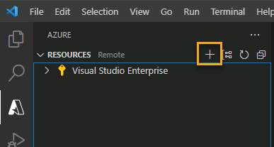

---
lab:
  topic: Azure Functions
  title: "Créer une Azure\_Function avec Visual\_Studio\_Code"
  description: "Découvrez comment créer une Azure\_Function avec un déclencheur HTTP. Une fois que vous avez créé et testé le code localement dans Visual\_Studio\_Code, vous déployez la fonction sur Azure."
---

# Créer une Azure Function avec Visual Studio Code

Dans cet exercice, vous allez découvrir comment créer une fonction C\# qui répond à des requêtes HTTP. Une fois que vous avez créé et testé le code localement dans Visual Studio Code, vous déployez et testez la fonction dans Azure.

Tâches effectuées dans cet exercice :

* Créer votre projet local
* Exécuter la fonction localement
* Déployer et exécuter la fonction dans Azure
* Nettoyer les ressources

Cet exercice dure environ **15** minutes.

## Avant de commencer

Pour compléter cet exercice, vous avez besoin de :

* Un abonnement Azure. Si vous n’en avez pas, vous pouvez [vous inscrire](https://azure.microsoft.com/).

* [Visual Studio Code](https://code.visualstudio.com/) sur l’une des [plateformes prises en charge](https://code.visualstudio.com/docs/supporting/requirements#_platforms).

* [.NET 8](https://dotnet.microsoft.com/en-us/download/dotnet/8.0) est le framework cible.

* [Kit de développement C#](https://marketplace.visualstudio.com/items?itemName=ms-dotnettools.csdevkit) pour Visual Studio Code.

* [Extension Azure Functions](https://marketplace.visualstudio.com/items?itemName=ms-azuretools.vscode-azurefunctions) pour Visual Studio Code.

* Azure Functions Core Tools version 4.x. Exécutez les commandes suivantes dans un terminal pour installer Azure Functions Core Tools sur votre système. Consultez [Azure Functions Core Tools sur GitHub](https://github.com/Azure/azure-functions-core-tools?tab=readme-ov-file#installing) pour obtenir des instructions d’installation sur d’autres plateformes.

    ```
    winget uninstall Microsoft.Azure.FunctionsCoreTools
    winget install Microsoft.Azure.FunctionsCoreTools
    ```

    Si vous rencontrez des erreurs lors de l’installation d’Azure Functions Core Tools, recherchez une solution en fonction du code d’erreur. Réessayez ensuite la commande **winget install** de l’étape précédente.

## Créer votre projet local

Dans cette section, vous utilisez Visual Studio Code pour créer un projet Azure Functions local en C#. Plus loin dans cet exercice, vous publierez le code de votre fonction sur Azure.

1. Dans Visual Studio Code, appuyez sur F1 pour ouvrir la palette de commandes, recherchez et exécutez la commande **Azure Functions : Créer un projet...**.

1. Sélectionnez l’emplacement de répertoire pour votre espace de travail de projet et optez pour **Sélectionner**. Vous devez créer un dossier ou choisir un dossier vide pour l’espace de travail du projet. Ne choisissez pas de dossier de projet qui fait déjà partie d’un espace de travail.

1. Quand vous y êtes invité, indiquez les informations suivantes :

    | Prompt | Action |
    |--|--|
    | Sélectionner le dossier où placer votre projet de fonction | Sélectionnez **Parcourir...** pour sélectionner un dossier pour votre application.
    | Sélectionner une langue | Sélectionnez **C#**. |
    | Sélectionner un runtime .NET | Sélectionnez **.NET 8.0 isolé**. |
    | Sélectionner un modèle pour la première fonction de votre projet | Sélectionnez **Déclencheur HTTP**.<sup>1</sup> |
    | Fournir un nom de fonction | Saisissez `HttpExample`. |
    | Fournir un espace de noms | Saisissez `My.Function`. |
    | Niveau d’autorisation | Sélectionnez l’option **Anonyme**, qui permet à quiconque d’appeler le point de terminaison de votre fonction. |

    <sup>1</sup> En fonction de vos paramètres VS Code, il peut être nécessaire d’utiliser l’option **Change template filter** (Modifier le filtre de modèle) pour afficher la liste complète des modèles.

1. Visual Studio Code utilise les informations fournies et génère un projet Azure Functions avec un déclencheur HTTP. Vous pouvez voir les fichiers de projet locaux dans l’Explorateur.

    > **Remarque** : Si VS Code affiche une fenêtre contextuelle avec le titre **Faites-vous confiance aux auteurs des fichiers dans ce dossier ?**, sélectionnez le bouton **Oui, je fais confiance aux auteurs**.

### Exécuter la fonction localement

Visual Studio Code s’intègre à Azure Functions Core Tools pour vous permettre d’exécuter ce projet sur votre ordinateur de développement local avant toute publication sur Azure.

1. Vérifiez que le terminal est ouvert dans Visual Studio Code. Vous pouvez ouvrir le terminal en sélectionnant **Terminal**, puis **Nouveau terminal** dans la barre de menus. 

1. Appuyez sur **F5** pour démarrer le projet d’application de fonction dans le débogueur. La sortie de Core Tools est affichée dans le panneau **Terminal**. Votre application démarre dans le panneau **Terminal**. Vous pouvez voir le point de terminaison de l’URL de votre fonction déclenchée par HTTP en cours d’exécution localement.

    

1. Avec Core Tools en cours d’exécution, ouvrez l’extension **Azure**. Dans la section **Espace de travail** de l’extension, développez **Projet local** > **Fonctions**. Cliquez avec le bouton droit sur la fonction **HttpExample** et sélectionnez **Exécuter la fonction maintenant**.

    

1. Dans **Entrer le corps de la demande**, tapez la valeur du corps du message de demande `{ "name": "Azure" }`. Appuyez sur **Entrée** pour envoyer ce message de demande à votre fonction. Quand la fonction s’exécute localement et retourne une réponse, une notification est générée dans Visual Studio Code.

    sélectionnez l’icône de cloche de notification pour afficher la notification. Les informations relatives à l’exécution de la fonction sont affichées dans le panneau **Terminal**.

1. Appuyez sur **Maj+F5** pour arrêter Core Tools et déconnecter le débogueur.

Après avoir vérifié que la fonction s’exécute correctement sur votre ordinateur local, vous pouvez maintenant utiliser Visual Studio Code pour publier le projet directement sur Azure.

## Déployer et exécuter la fonction dans Azure

Dans cette section, vous créez une ressource Azure Function App et déployez la fonction sur la ressource.

### Connexion à Azure

Avant de pouvoir publier votre application, vous devez vous connecter à Azure. Si vous êtes déjà connecté, passez à la section suivante.

1. Si vous n’êtes pas déjà connecté, choisissez l’icône Azure dans la barre d’activité, puis dans la zone **Azure : Ressources**, choisissez **Se connecter à Azure...**.

    

1. Quand vous y êtes invité dans le navigateur, choisissez votre compte Azure, puis connectez-vous à l’aide de vos informations d’identification de compte Azure.

1. Une fois la connexion réussie, vous pouvez fermer la nouvelle fenêtre de navigateur. Les abonnements qui font partie de votre compte Azure sont affichés dans la barre latérale.

### Créer des ressources dans Azure

Dans cette section, vous allez créer les ressources Azure dont vous avez besoin pour déployer votre application de fonction locale.

1. Choisissez l’icône Azure dans la barre d’activité, puis dans la zone **Ressources**, sélectionnez le bouton **Créer une ressource...**.

        

1. Quand vous y êtes invité, indiquez les informations suivantes :

    | Prompt | Action |
    |--|--|
    | Sélectionnez une ressource à créer | Sélectionnez **Créer une application de fonction dans Azure...** |
    | Sélectionner un abonnement | Sélectionnez l’abonnement à utiliser. *Vous ne verrez pas ceci si vous n’avez qu’un seul abonnement.* |
    | Entrer un nom global unique pour l’application de fonction | Tapez un nom valide dans un chemin d’accès URL, par exemple `myfunctionapp`. Le nom que vous tapez est validé pour s’assurer qu’il est unique. |
    | Sélectionnez un emplacement pour les nouvelles ressources | Pour de meilleures performances, sélectionnez une région proche de vous. |
    | Sélectionner une pile d’exécution | Sélectionnez **.NET 8.0 isolé**. |
    | Sélectionnez le type d’authentification des ressources | Sélectionnez **Secrets** |

    L’extension montre l’état des ressources individuelles au fur et à mesure qu’elles sont créées dans Azure, dans la zone **AZURE** de la fenêtre du terminal.
    
1. Quand vous avez terminé, les ressources Azure suivantes sont créées dans votre abonnement et leurs noms reposent sur le nom de votre application de fonction :

    * Un groupe de ressources, qui est un conteneur logique pour les ressources associées.
    * Un compte de stockage Azure standard, qui conserve l’état et d’autres informations spécifiques à vos projets.
    * Un plan de consommation flexible, qui définit l’hôte sous-jacent pour votre application de fonction serverless.
    * Une application de fonction, qui fournit l’environnement d’exécution de votre code de fonction. Une application de fonction vous permet de regrouper des fonctions en une unité logique pour faciliter la gestion, le déploiement et le partage des ressources au sein du même plan d’hébergement.
    * Une instance Application Insights connectée à l’application de fonction, qui effectue le suivi de l’utilisation de votre fonction serverless.

### Déployer le projet dans Azure

> **! Important :** la publication sur une fonction existante remplace tous les déploiements précédents.

1. Dans la palette de commandes, recherchez et exécutez la commande **Azure Functions : déployer sur l’application de fonction**.

1. Sélectionnez l’abonnement que vous avez utilisé lors de la création des ressources.

1. Sélectionnez l’application de fonction que vous avez créée. Quand vous êtes invité à remplacer les déploiements précédents, sélectionnez **Déployer** pour déployer le code de votre fonction sur la nouvelle ressource de l’application de fonction.

1. Une fois le déploiement terminé, sélectionnez **Afficher la sortie** pour afficher les détails des résultats du déploiement. Si vous manquez la notification, sélectionnez l’icône de cloche de notification dans le coin inférieur droit pour la voir de nouveau.

    

### Exécuter la fonction dans Azure

1. De retour dans la zone **Ressources** de la barre latérale, développez votre abonnement, votre nouvelle application de fonction et **Fonctions**. **Cliquez avec le bouton droit** sur la fonction **HttpExample** et choisissez **Exécuter la fonction maintenant**.

    

1. Dans **Entrer le corps de la requête**, vous pouvez voir la valeur du corps du message de requête pour `{ "name": "Azure" }`. Appuyez sur Entrée pour envoyer ce message de demande à votre fonction.

1. Quand la fonction s’exécute dans Azure et retourne une réponse, une notification est générée dans Visual Studio Code. sélectionnez l’icône de cloche de notification pour afficher la notification.

## Nettoyer les ressources

Maintenant que vous avez terminé l’exercice, vous devez supprimer les ressources cloud que vous avez créées pour éviter une utilisation inutile des ressources.

1. Dans votre navigateur, accédez au portail Azure [https://portal.azure.com](https://portal.azure.com) et connectez-vous en utilisant vos informations d’identification Azure.
1. Accédez au groupe de ressources que vous avez créé et affichez le contenu des ressources utilisées dans cet exercice.
1. Dans la barre d’outils, sélectionnez **Supprimer le groupe de ressources**.
1. Entrez le nom du groupe de ressources et confirmez que vous souhaitez le supprimer.

> **ATTENTION :** La suppression d’un groupe de ressources entraîne la suppression de toutes les ressources qu’il contient. Si vous avez choisi un groupe de ressources existant pour cet exercice, toutes les ressources existantes qui ne relèvent pas du champ d’application de cet exercice seront également supprimées.
